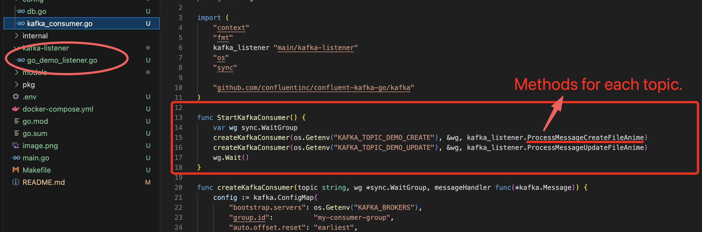

# Go-Kafka-Consumer


## # Kafka Consumer Configuration Guide

   **1. Start kafka producer :**  https://github.com/Uawsscu/Go-demo

   **2. Kafka Topic**: Identify the Kafka topic from which you want to consume data.

   at file 'kafka_consumer.go'
   
   

   

   **3. Start kafka consumer :**
   - [Go-demo] make sure 'Go-demo' project started successfully
   - [Go-Kafka-Consumer]'' 
   ```
    go run main.go
   ```
   - [Go-demo] call api http://localhost:8080/anime/demoKafka and check logs at [Go-Kafka-Consumer] 
   
   -------------- Finish :)-------------- 

   

   